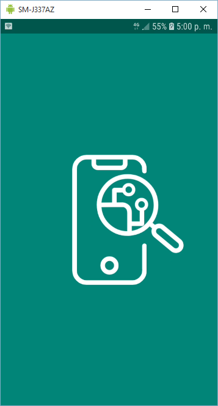
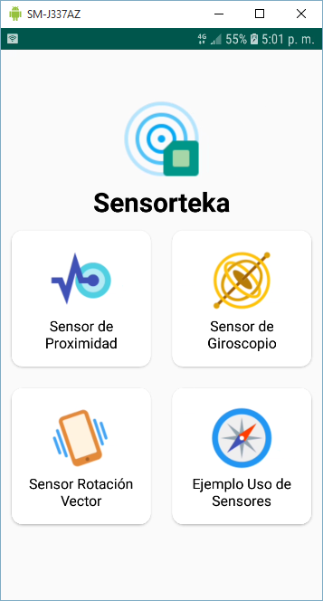
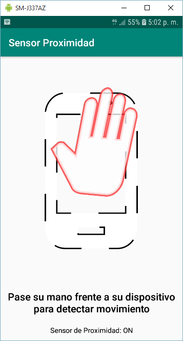
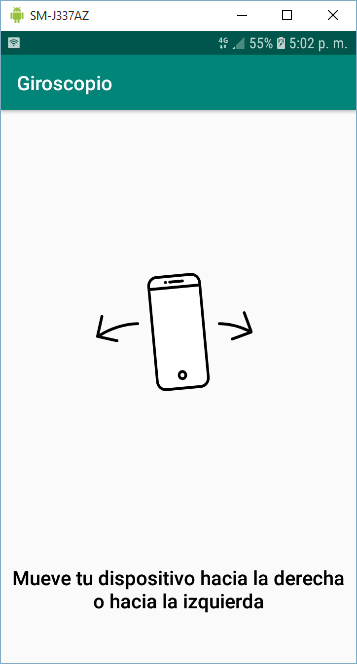
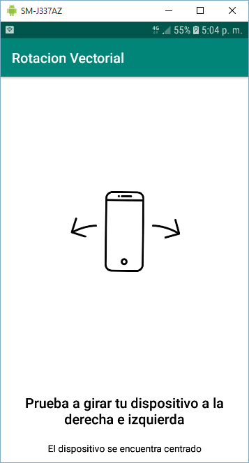
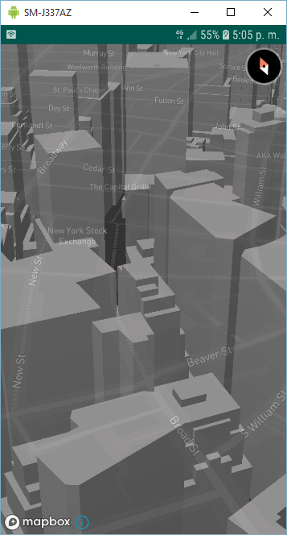

# Sensorteka
Esta aplicacion muestra el uso de sensores en un dispositivo Android

## Descripción
En esta aplicación usted podra manipular algunos de los sensores con los que cuenta su dispositivo, algunos de ellos son
- Sensor de Proximidad
- Sensor de Giroscopio
- Sensor Rotación Vector
- Acelerometro
- Sensor Magnetico

## Capturas de Pantalla
### Splash Screen

### Menu de Opciones

### Sensor de Proximidad en Acción
En esta pantalla se detecta si el usuario coloca algo frente al dispositivo, si es asi el telefono responde con una vibración y una notificacion en TextView en la parte inferior

### Sensor Giroscopio
En esta pantalla se detecta si hay movimiento a la izquierda o derecha del dispositivo si es asi se responde con un color diferente y una notificacion en un TextView

### Sensor Rotación Vector
Similar a la pantalla anterior, aqui hay 3 escenarios distintos, centro, izquierda y derecha, la diferencia radica en el uso del sensor

### Ejemplo de Mapbox y rotación
En esta pantalla se hace uso del acelerometro y del sensor magnetico para que actuen como brujula y dependiendo el movimiento que haga el usuario en su dispositivo, el mapa de Mapbox se mueva.

Es indispensable que te registres en mapbox para poder adquirir una token, el token que adquieras copialo en la ruta /res/values/strings.xml en el string access_token

